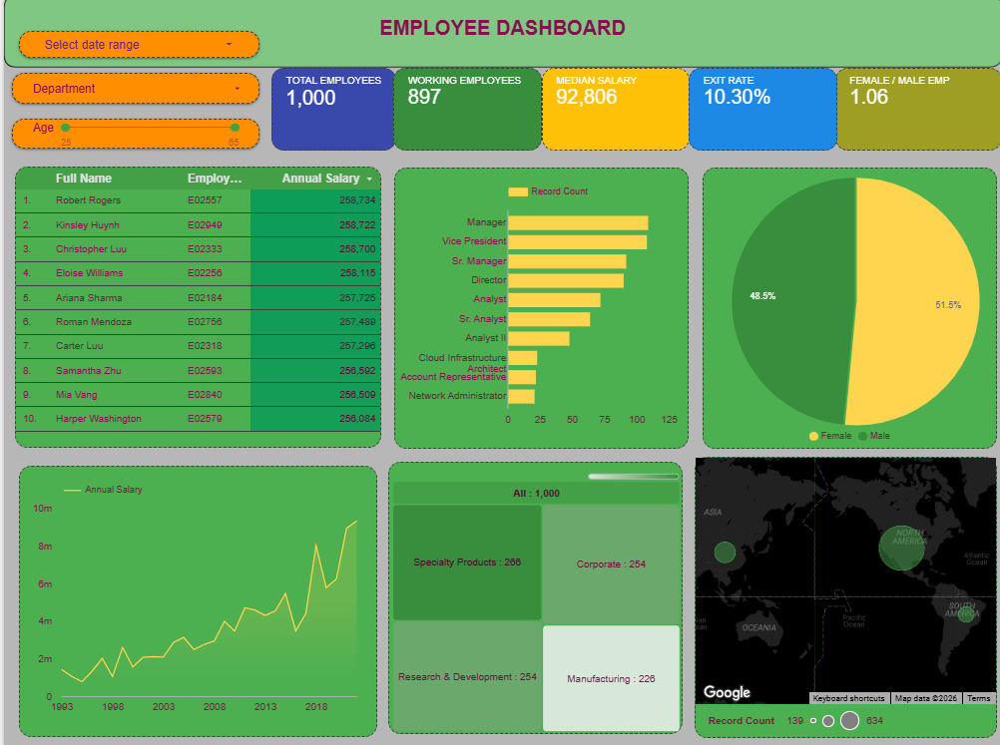

# 📊 Employee Analytics Dashboard

An interactive HR Analytics Dashboard built using **Google Looker Studio** to monitor workforce performance, employee demographics, salary trends, and organizational insights.

## 🚀 Dashboard Overview

This dashboard helps HR teams and management analyze employee data through interactive KPIs and visualizations.

### Key KPIs
- Total Employees
- Working Employees
- Median Salary
- Exit Rate
- Female/Male Ratio

### Dashboard Features
- Date Range Filter
- Department Filter
- Age Filter
- Employee Salary Table
- Designation-wise Employee Distribution
- Gender Distribution
- Salary Trend Analysis
- Department-wise Treemap
- Geographic Distribution Map

## 🛠 Tech Stack

- Google Looker Studio
- Google Sheets
- Microsoft Excel
- Data Visualization
- Business Intelligence

## 📈 Skills Demonstrated

- Data Cleaning
- KPI Development
- Dashboard Design
- Interactive Reporting
- HR Analytics
- Business Intelligence
- Data Storytelling

## 🔗 Live Dashboard

https://datastudio.google.com/reporting/04ef1724-29bd-4758-acae-5c1811d435a7

## 📷 Dashboard Preview

## 👨‍💻 Author

**Ashish**

LinkedIn: https://linkedin.com/in/ashish-b2b826256

GitHub: https://github.com/ASHISH90111
